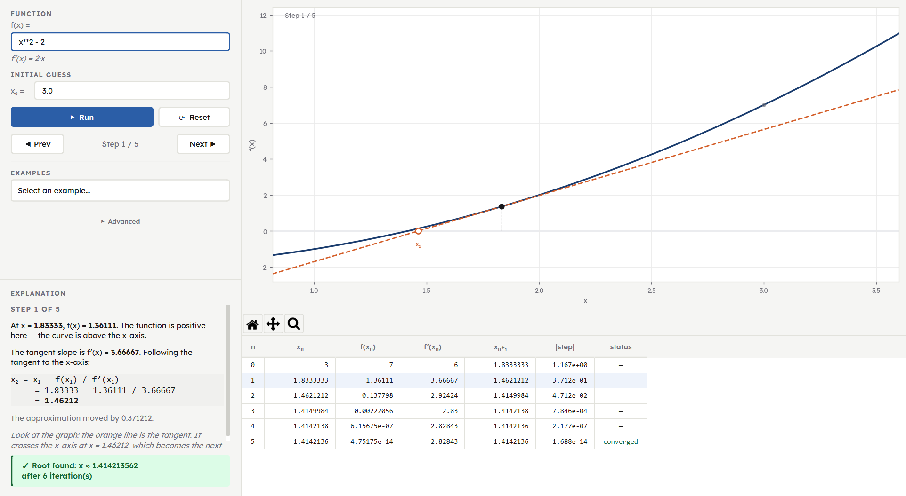

# Newton's Method Explorer

A beginner-friendly desktop app for visualizing Newton's method step by step: the initial guess, tangent line, next approximation, convergence, and failure cases.

## Screenshot



## What This App Teaches

Newton's method finds a root of `f(x)` by drawing the tangent line at the current approximation and following that line to the x-axis. This app shows why each approximation moved where it did, not just the final answer.

## Requirements

- Python 3.11 or later
- pip

## Installation

```bash
# 1. Clone the repository
git clone https://github.com/kieran-lucas/beginner_newton-method.git
cd beginner_newton-method

# 2. Create and activate a virtual environment
python -m venv .venv

# Windows
.venv\Scripts\activate

# macOS / Linux
source .venv/bin/activate

# 3. Install dependencies
pip install -r requirements.txt
```

## Running The App

```bash
python main.py
```

The window requires a minimum size of `1020 x 680` px.

## Developer Setup

```bash
pip install -r requirements-dev.txt
```

## Running Tests

```bash
pytest tests/
```

## Build / Package

Packaging is not configured yet. The app runs directly from source with `python main.py`.

## Project Structure

```text
beginner_newton-method/
|-- main.py                     entry point
|-- app/
|   |-- style.py                color tokens, font sizes, Qt stylesheet
|   |-- newton.py               numerical core
|   |-- expression.py           SymPy expression parser
|   |-- plot.py                 Matplotlib canvas widget
|   |-- window.py               MainWindow, assembles all panels
|   |-- presets.py              built-in example functions
|   `-- panels/
|       |-- input_panel.py      function input, x0, run/reset, step navigator
|       |-- table_panel.py      per-iteration data table
|       `-- status_panel.py     plain-English explanation and result badge
|-- assets/
|   `-- screenshot.png
|-- tests/
|   |-- test_expression.py
|   `-- test_newton.py
|-- docs/
|   `-- ux-spec.md
|-- ROADMAP.md
|-- requirements.txt
`-- requirements-dev.txt
```

## Development Status

| Stage | Description | Status |
| --- | --- | --- |
| 1 | Project scaffold | Done |
| 2 | Newton numerical core | Done |
| 3 | Expression parsing with SymPy | Done |
| 4 | Graph and tangent visualization | Done |
| 5 | Iteration table and explanation panel | Done |
| 6 | Convergence and failure diagnostics | Done |
| 7 | Presets and examples | Done |
| 8 | Export and polish | Not started |
| 9 | README and portfolio presentation | Done |
| 10 | Testing and validation | Not started |
